A journey to Neurofeedback
==========================

"A Journey to Neurofeedback: how blockchain is changing the biodata marketplace" was the name of our soft launch event (12th of February 2022 at Yayem Lisbon) where we created the [1st Edition Primal muLabsDAO BioNFT](https://opensea.io/assets/0x495f947276749ce646f68ac8c248420045cb7b5e/906393353003173331710428313945144357877461134456135633465482471942096158721)
 and co-created with the crowd the [Primal muLabsDAO BioNFTs Collection](https://opensea.io/collection/primalbionfts) based in real-time brain-data; also we did VR experiences, Neurofeedback training sessions, talks, a brain-music performance and an audio-visual reactive sound journey.

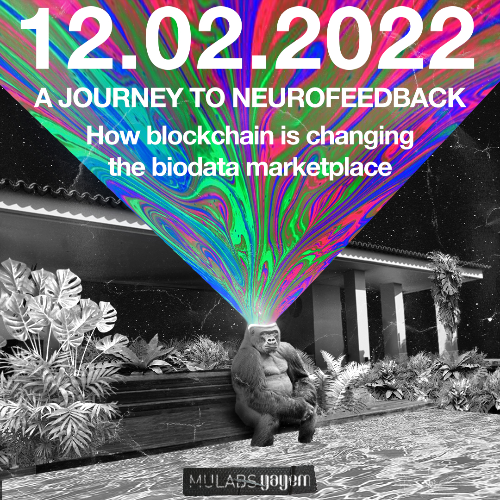

BioNFT
------

The programmable blockchain let their users create tokens through smart contracts. One of the standards being the ERC-721 the Non-Fungible Token. One can now represent a unique asset in the blockchain wether it be digital or a real world item (Art, Collectibles, Scarce Assets, etc). NFTs can be minted into the blockchain and live there for eternity, letting owners transfer them.

Bio data is something that would benefit a lot from blockchain technology. We have been dismissive of how data is treated in web2 and now with web3 it can be a lot different. As a consequence data is only analyzed by in-house algorithms. Personal data is often sold to third parties and with no way for users to be rewarded. If BCI tech actually gets mainstream to a certain point then our bio metric data is something we should care for a lot. We want to create a standard for how bio metric data is treated, we call it the Brain Protocol and it’s powered by the muLabsDAO. Talent is on high demand and this mission is not cheap. We want to fund it through our BioNFT Art collections. Early investors in this project will benefit from holding these NFTs has we plan on airdropping the future network tokens to hodlers.
and keep track of ownership and their value.

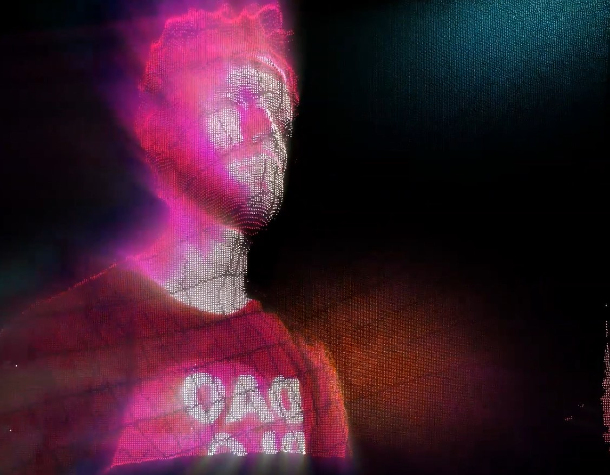

Collections Roadmap
-------------------

+ 1st Edition Primal BioNFT (Auction @ Yayem 12-02-2022)
+ 3 Funding round collections (Gold, Silver and Bronze get whitelisted through POAPs)
+ Brain Gems
+ Stimulae
+ Famous Artists Collabs
+ Boom Festival 2022

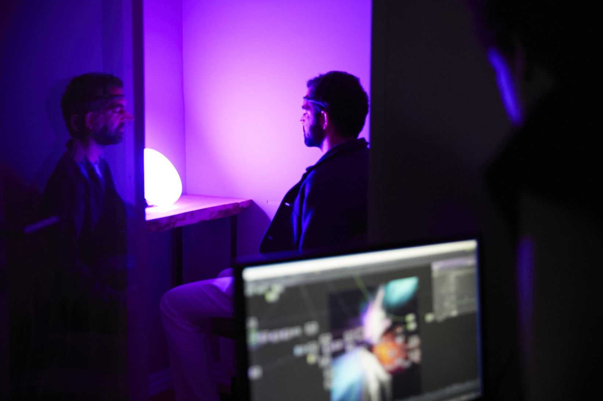

Why we do events
----------------

We want to bring attention to our project and the efforts we have been making into creating a decentralized marketplace for brain-data and how people can benefit from Neurofeedback. The Most importantly is that we want to promote open discussions about the relationship between Blockchain, Neuroscience, Data Science, Art, Music, etc. 

Face-to-face is the most effective way to get to know each other, spread knowledge, solve problems, and make decisions. So that's the purpose of the events - to get everyone together!

Good food and good drinks in stunning locations.

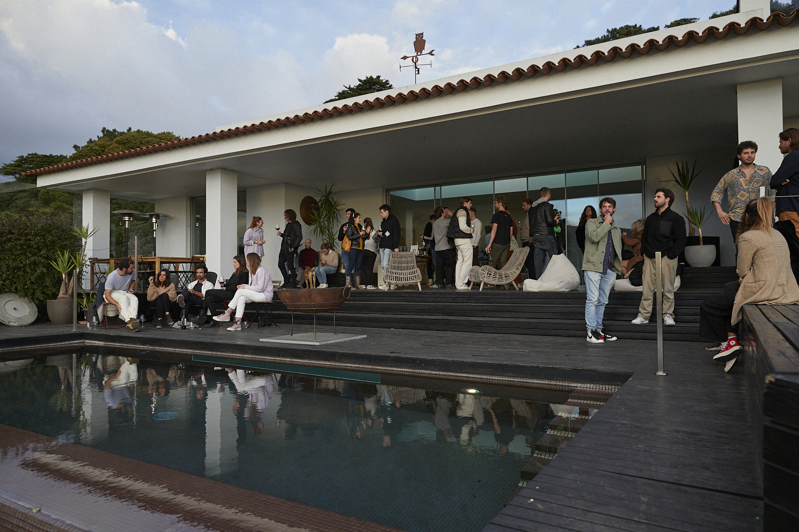

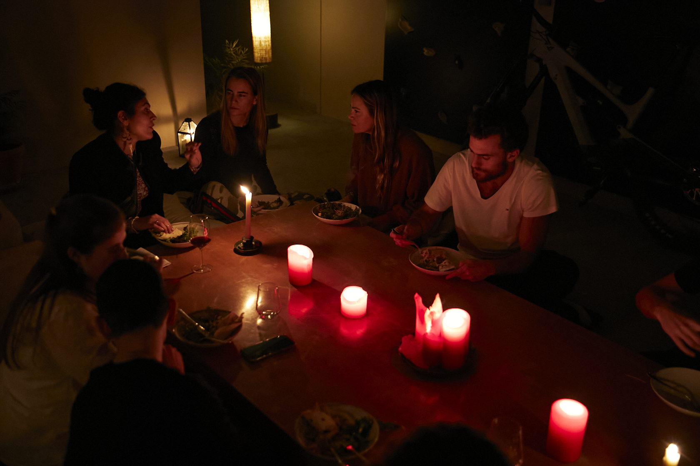

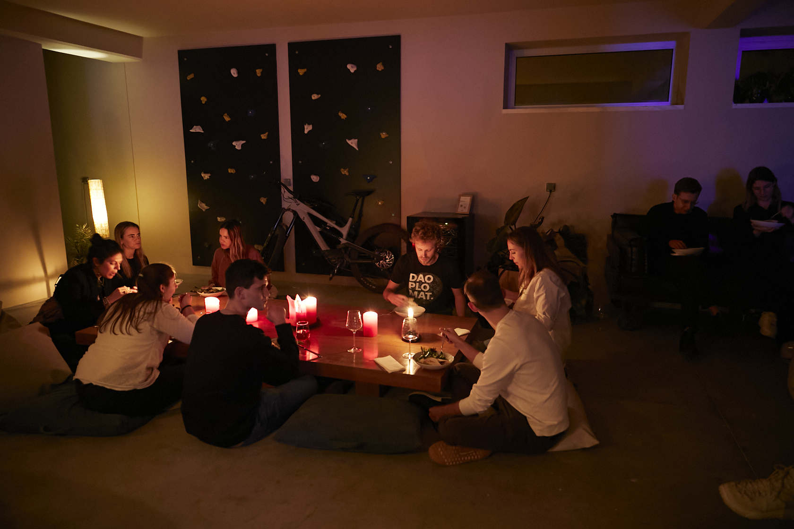

Last events location
--------------------

|   **Country** |     **City**    | **Partipants** | **Location address**            |
| :------------:|:---------------:|:--------------:|:--------------------------------|
| Portugal      | Lisbon(Cascais) |       43       | Rua dos 4 Moinhos 375, 2755-190 |

Does everyone have to attend?
-----------------------------

More or less, yes. We haven't made it a formal rule, but implicitly people are expected to attend "most" conferences (sometimes Life gets in the way of course). We also get to know each other better, build trust, trade knowledge, and have lots of fun!

Guiding principles
------------------

Our events are based on the [Open Space](http://en.wikipedia.org/wiki/Open_Space_Technology) format.

That means the only real rule is the **Law of 2 feet**. Our version of it is: **"if you aren't contributing or learning or having fun where you stand now, use your two feet (and go somewhere where you can contribute or learn or have fun)!"**

Other guiding principles (we vary them a bit, but this should give you the general idea):

-   **Whoever comes are the right people.**
    -   You can influence people, but not control them. The people who decided to come to your session are the right people, because they chose to come. What if nobody shows up? Don’t worry. How often do you get time to really sit down and reflect on a topic? Take the chance! And maybe people will show up after a while. Or you simply use the law of 2 feet and go somewhere else.
-   **It's up to you.**
    -   If you want something to happen, or a topic to come up, or a decision to be made, do something about it. Don’t expect someone else to do it for you.
-   **Whatever happens is the only thing that could have.**
    -   Prepare to be surprised! Things rarely turn out as expected, so there’s no point in fretting over what should have happened or might have happened. Take each moment as it comes, and make the best of it.
-   **It's over when it's over.**
    -   We have time slots, but a conversation doesn't have to be exactly that long, not does it have to stay on topic. Maybe you want to continue this topic for another hour! That’s fine, although in that case you might want to move your group out of the way, to make space for the next group.

What's the event format?
------------------------

Here's a summary of what we typically do on a event day:

### 1. Do some lightning talks, or short team-building activities to get everyone inspired

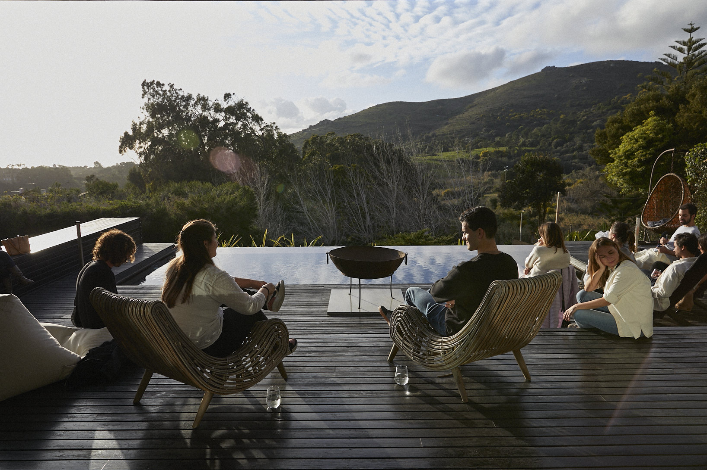

### 2. Present the format and Brainstorm topics

Gather everyone in a ring. Present the open space format & today's theme (sometimes we have a theme, sometimes not). Show the empty schedule grid, and ask people to suggest topics and write on stickies.

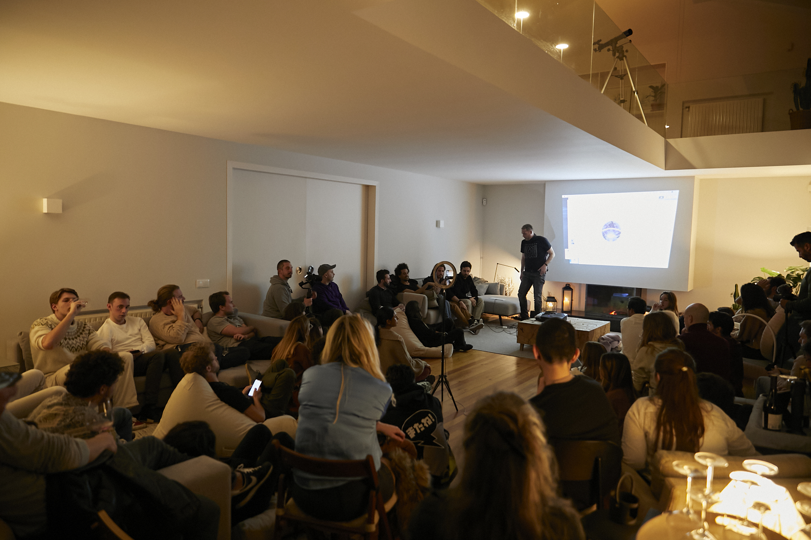

### 3. Create a schedule

Ask the people who suggested topics to organize them into the schedule grid. Left-to-right are all the locations in the room, and up-to-down are all the time slots (usually 30-60 minutes each). And a small section to capture "mini-topics" for when we all gather at the end.

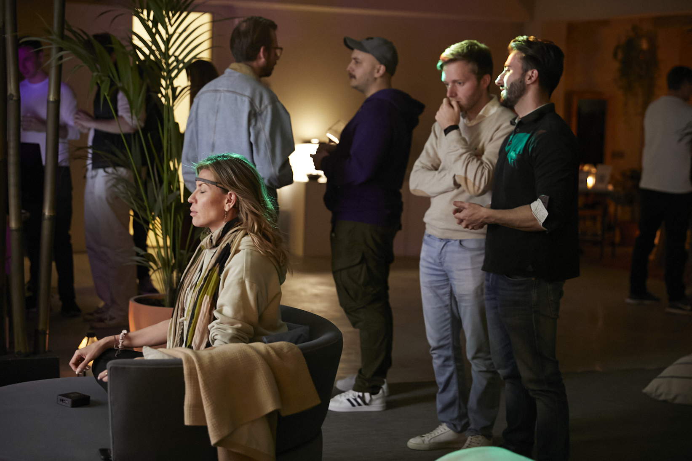

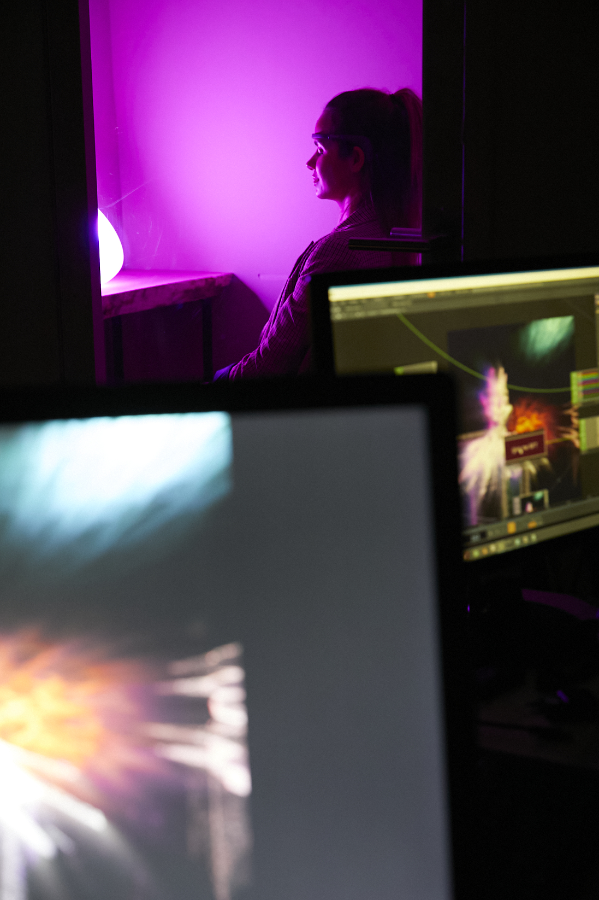

### 4. Breakouts!

Now everyone knows approximately what's happening when & where! The schedule is a guide, not a hard constraint. Lots of other interesting and unplanned topics are going to pop up here and there. Let people self-organize for the next few hours, using the Law of 2 Feet. Make sure there is plenty of snacks, fruit, coffee & drink around.

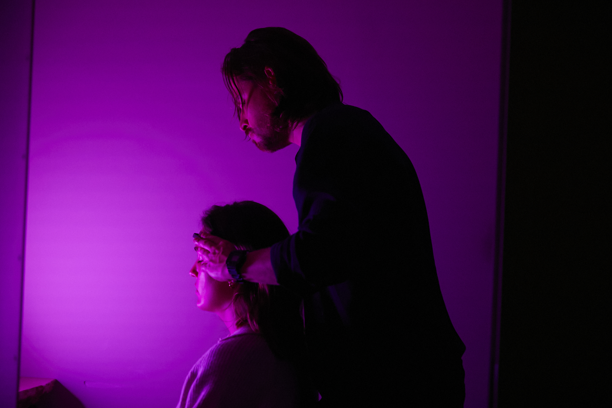

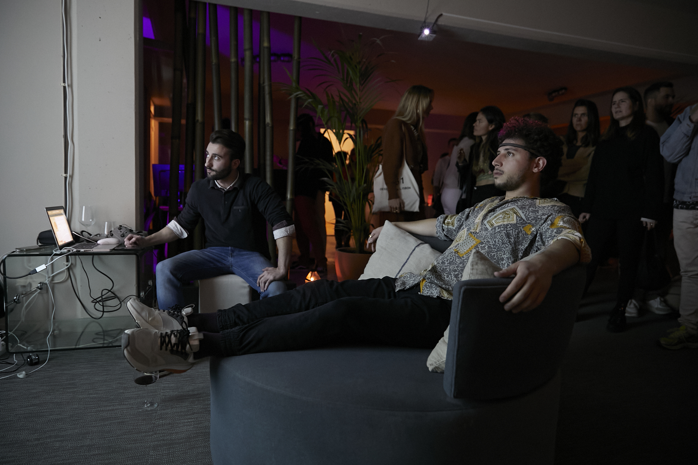

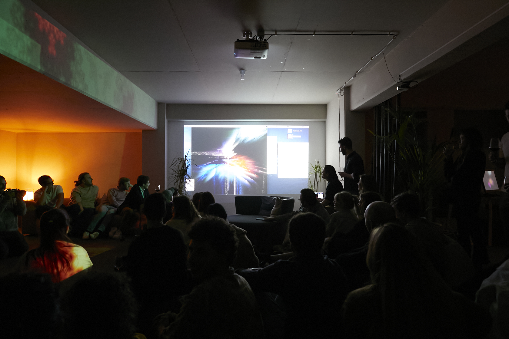

### 5. Gather up for summaries and decisions

One hour before the end, gather everyone back into the ring. For each topic, ask someone to do a 2 minute summary of what came out. Collect key decisions/actions on the wall. Ask if anyone else has anything to say, or if there are any decisions that need to be made while we are all gathered.

We have a [consensus-based decision model](decisions.html) 

Finally we wrap up by asking people to share their key take-aways from the day.

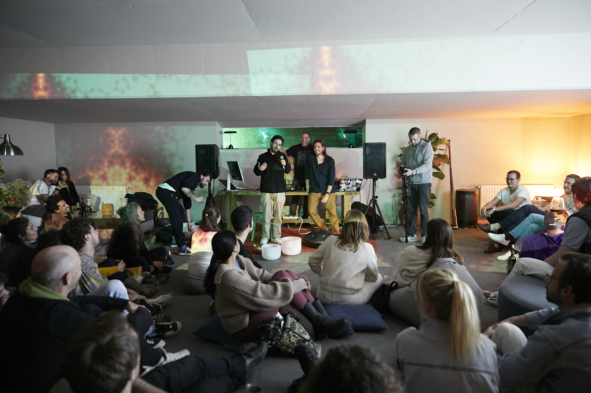
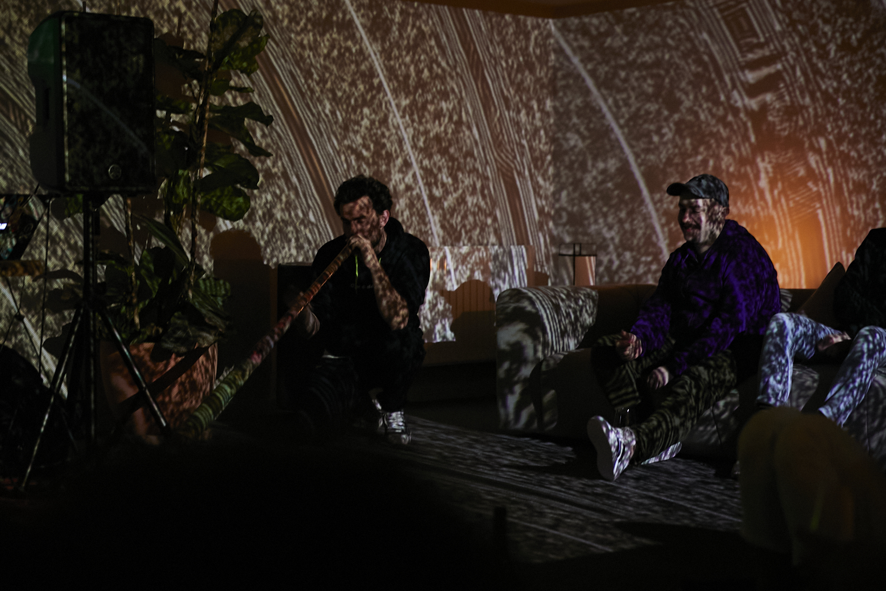
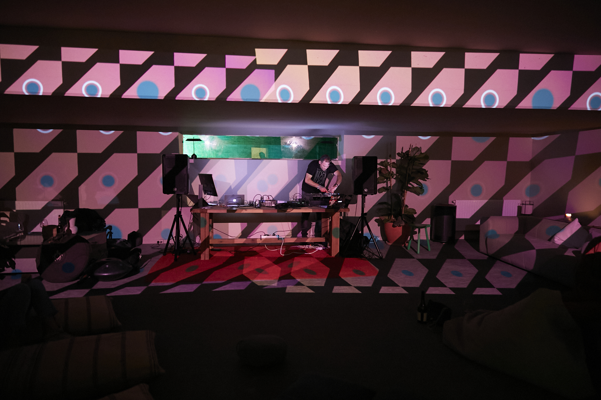

