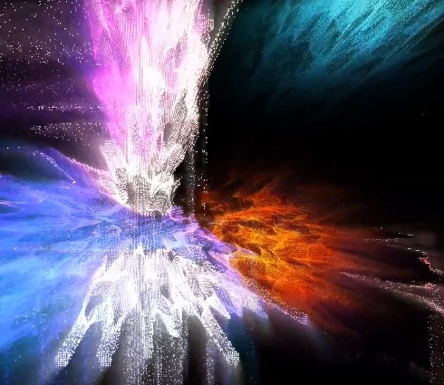

What is muLabsDAO?
==================

This site is an [open-source](http://en.wikipedia.org/wiki/Open_source) site describing how muLabsDAO works and why.

muLabsDAO is a collective of Neuroscientists, Data Scientists, Blockhain Developers, Artists, Tech Enthusiasts, and everyone else who is interested in joining a community effort to raise awarness to the mental health benefits of [Neurofeedback](https://en.wikipedia.org/wiki/Neurofeedback) by creating The Brain Protocol, a decentralized marketplace for biodata research.

After some years of experiences, [research](../assets/NEUROTECHNIX_2017_Scientific_Paper.pdf "Scientific Paper")
and prototypes at [muArts](https://muarts.tech) we are sharing our knowledge to speed-up the development and implementation of the Tokenomics around the [brainToken](https://muarts.tech/braintoken/) using a [Decentralized Autonomous Organization](https://en.wikipedia.org/wiki/Decentralized_autonomous_organization) that live on the [blockhain](https://en.wikipedia.org/wiki/Blockchain) to develop the Brain Protocol (DeSci) that will be owned also by the community through governance tokens.

At the core of the research and development, we have the BCI Neurofeedback Framework, that allows people to connect their minds to discover, show, interact and transform the most valuable signals of the common life, our brain activity. In other words, an agnostic biodata network and marketplace for any wearable [BCI](https://en.wikipedia.org/wiki/Brain%E2%80%93computer_interface) technology backed by the Proof-of-Brain-Work. We want too to create the muMiner (concept) to support with our own hardware the future of this decentralized network. 

We are also exploring the creation of BioNFT, promoting amazing events to meet new partners in the real-reality, enjoy and create singular crypto-art assets that will funding the development of our [proposals](proposals.html) in the muLabsDAO! 

Characteristics of our Chaordic Organization
-------------------------------------------- 

-   Based on clarity of shared purpose and principles
-   Self-organizing and self-governing in whole and in part
-   Exist primarily to enable their constituent parts
-   Powered from the periphery, unified from the core
-   Durable in purpose and principle, malleable in form and function
-   Equitably distribute power, rights, responsibility and rewards
-   Harmoniously combine cooperation and competition
-   Learn, adapt and innovate in ever expanding cycles
-   Compatible with the human spirit and the biosphere
-   Liberate and amplify ingenuity, initiative and judgment
-   Compatible with and foster diversity, complexity and change
-   Constructively utilize and harmonize conflict and paradox
-   Restrain and appropriately embed command and control methods.

Some facts
----------

-   We rely on self-organization and transparency. Almost everything is bottom-up, and [anyone can drive any decision](decisions.html).
-   muLabsDAO doesn't want to earn money from it's colaborators. It is in practice like a ["nonprofit organization"](https://en.wikipedia.org/wiki/Nonprofit_organization) (although not formally so). 
-   Our [ownership model](ownership-model.html) is designed to keep our stock financially worthless. There is no incentive to "cash in".

Why open-source the muLabsDAO DNA?
----------------------------------

-   To make the world a better place! The model has helped us be happy and make a positive impact in the world, and publishing it may help others do the same.
-   Open-sourcing it is a fun social experiment, we're curious about what's going to happen :o)
-   By making our model public, we're more likely to keep it up-to-date and improve it as we learn.
-   Putting it on GitHub makes it easier for others to clone and evolve the model, and we can learn from that.

Meta
----

> [How to clone the muLabsDAO DNA](how-to-copy.html)