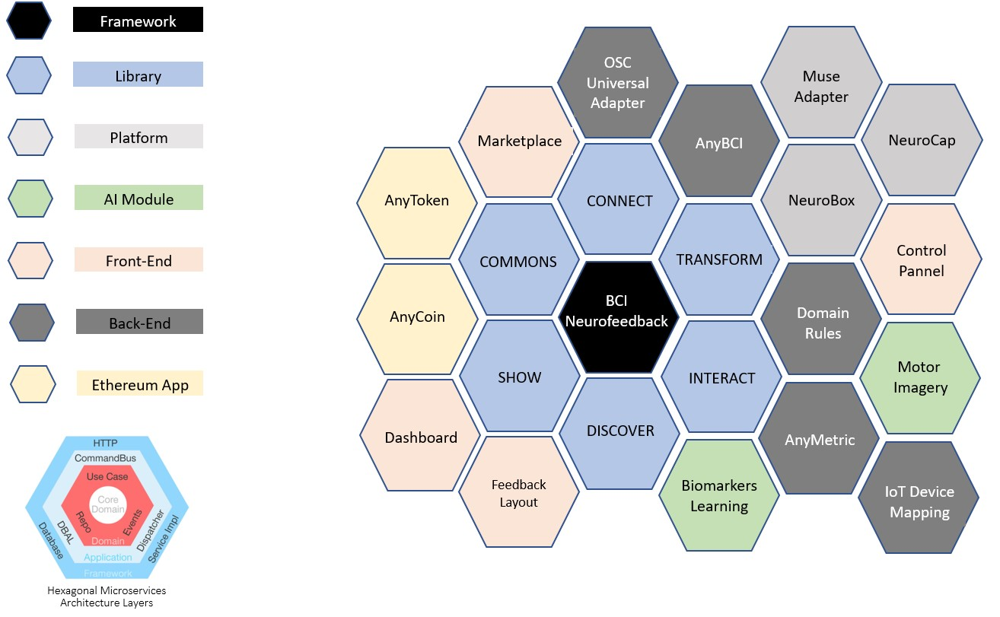

What is the Brain protocol and why?
===================================

The exponential growth in the brain computer interface industry, the blossom of new types of computing and the use of new approaches in deep, representation and machine learning shapes the latest technology trends in neuroscience, where the idea is to augment our perception using directly our mental states as an input to adapt and show representations of knowledge in hybrid environments as an output, with or without an intention; many institutions and individuals are behind these “blue ocean markets” with the simply drive of profit. Considering the nature of this kind of data sources, we believe that the most important are the identity of our thoughts as singular humans been in constant transition, inside of an infinite loop of sensations, perceptions, actions and emotions. 

The Brain Protocol (BrAIn Commons) is a collection of smart contracts based on blockchain and powered by open-source components that coordinate a decentralized ecosystem of brain data services allowing the exchange of the most valuable signals of our life, our encephalon activity recorded digitally by a specific technology. Focused in the electrophysiology of the brain, using mainly EEG, the objective is that anyone can add raw data from your brain to this secure database and according the nature of the session (context of the meta-data) could receive incentives through standard cryptocurrencies; the blockchain network will guarantee the immutability of the transactions preserving the identity and ownership of your thoughts and also the accountability of all the transactions that create value using your data in a transparent and comprehensive way.

> **The BCI Neurofeedback Framework implements the brain protocol using blockchain smart-contracts to preserve the identity of the EEG datasets acquired from BCI headsets. When the user share your data for their use in our network for a specific project, has the possibility of receive incentives in cryptocurrencies according the context of the recorded experience; for instance, an AI software that needs to train an specific machine learning model using brain datasets,will promote a project to acquire the data and will paid to the owners to have access to the meta-data for research and development**

Our objective is also integrate the framework with other DeSci solutions, keeping always the tracking of all the transactions executed; BrAIn Commons should be understood as the “Proof of Brain Work” of the users and the transaction chain that describe the value of the data recorded or activity.

**Type of DataSets**:
---------------------

**Proprietary Data**: data controlled only by the provider/owner;

**Free or Commons Data**: is generally free or open to use. This type of data has unlimited restriction on its usage.

Benefits
--------

+ Implementation of the concept “proof of brain work/activity”, keeping inside of a Ethereum blockchain network electroencephalography datasets acquired from different brain computer interface platforms and contexts, allowing the user to exchange this kind of information by standard cryptocurrencies like ETH preserving the ownership of your data;
+ Cloud-based neurofeedback web application to improve or reestablish the equilibrium of the users according the latest advances in the neuroscience research; able to identify electrical brain-waves patterns associated with mental states allowing the possibility of dynamically design new metrics using a rule-based logic.
+ A scalable marketplace of brain computer interface services for all the community that include different types of applications, plugins with brand-new neurofeedback layouts and the possibility of exchange your though user data when an artificial intelligence algorithm use the dataset to train a model;

System Architecture
-------------------
The entire framework works as a modular hybrid solution using on-premises and cloud-based microservices:

+ NeuroFramework (core software) 
    + On-premises:
        * Any-BCI Connect; 
        * OSC-BCI Universal Receiver; 
        * muMinner (hardware);
    + Cloud-based:
        * Machine Learning Biomarkers Explorer;
+ BrainProtocol (Proof-of-brain-work)
    * AnyToken API - Smart-Contract Coordinator, Exchange and Manager
+ NeuroServices (API Engine for Mental Performance)
    + Features:
        * Dynamic EEG Metrics Designer
        * Emotional (Engagement)
        * Motor Imagery (IoT)  
        * AnyMetric (custom formula/rule)

Further reading
---------------

[More about the complexity of evolution...](https://www.academia.edu/42779200/Our_natural_relation_with_the_Artificial_Intelligence_and_the_Complexity_of_Evolution)
